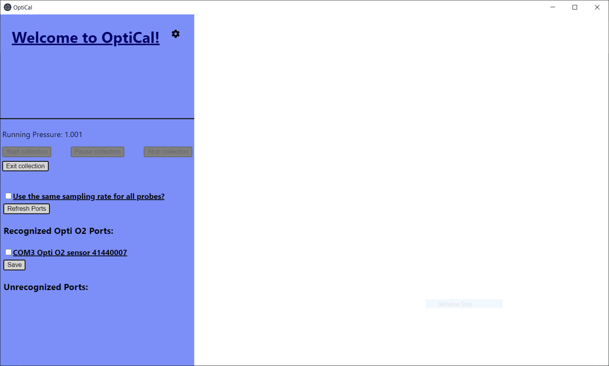
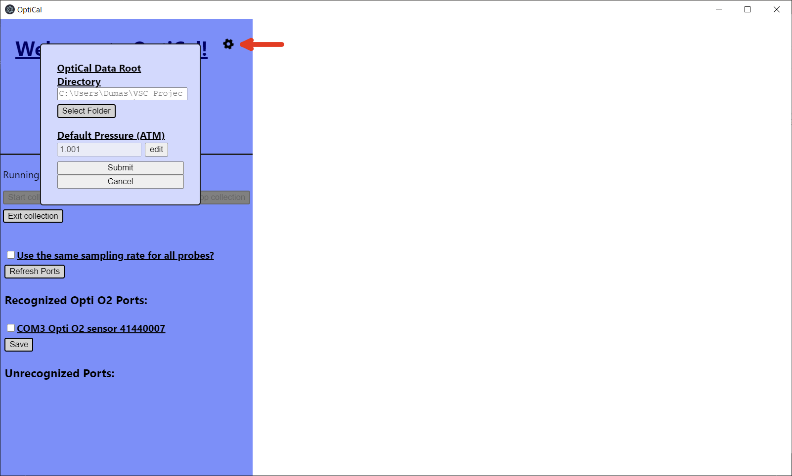
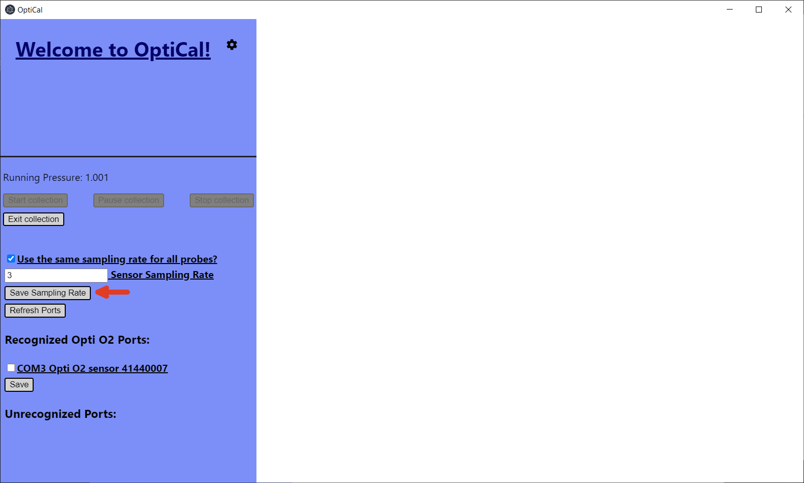
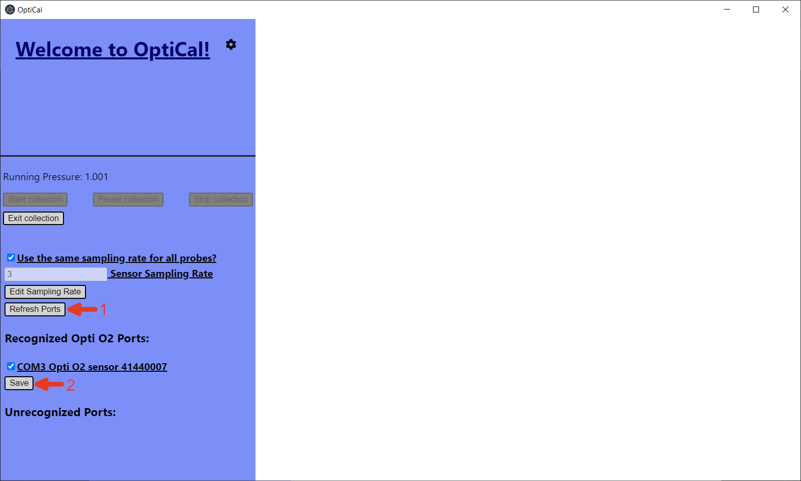
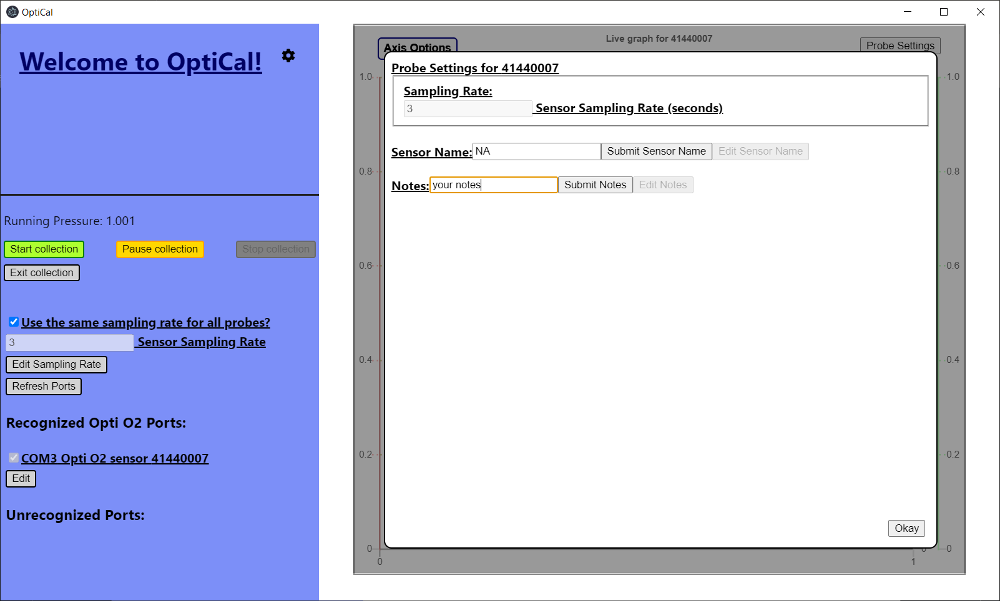
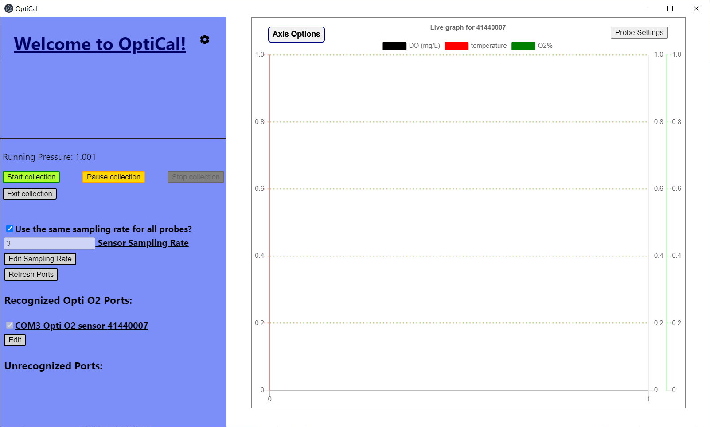
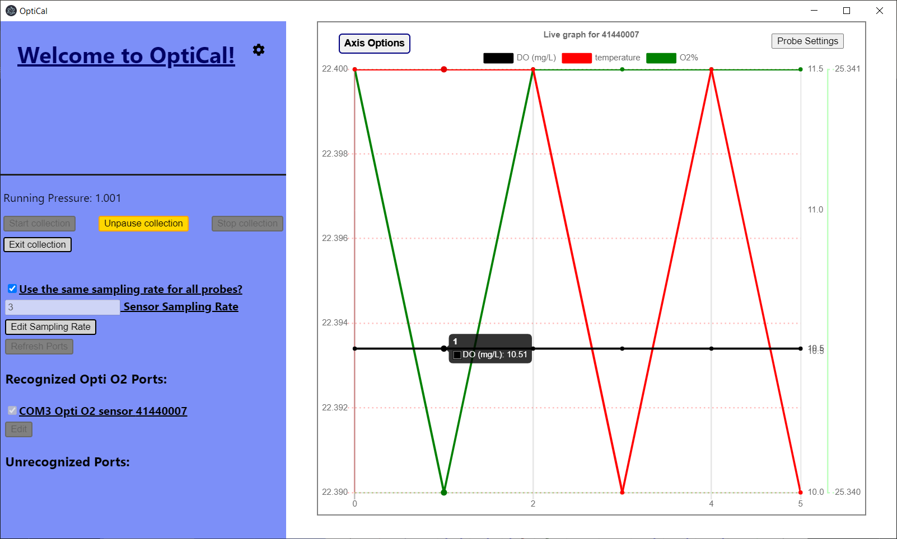
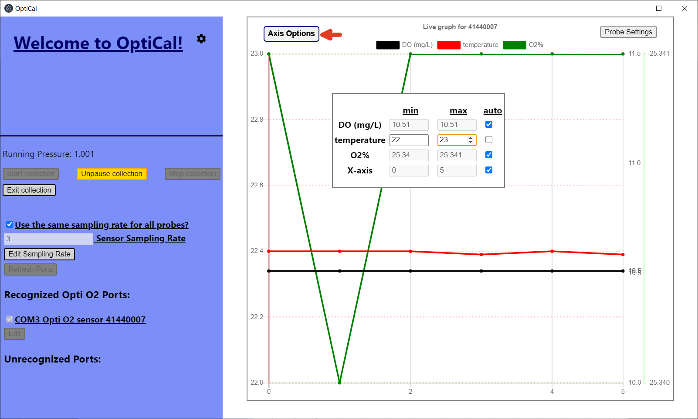

# OptiCal
The electron forge (hopefully final) custimer-facing version of OptiCal. 

In-house software designed to query Opti O2 dissolved oxygen sensors.

# Installation
If the user needs to create a new installer, after cloning the github repository run 

    npm run make

from the command line in the directory you cloned to. The installer will be located in .\out\make\squirrel.windows\x64. After running the installer, a shortcut to the installed version of OptiCal should be created on your desktop. The location of the installed application will be C:\Users\User\AppData\Local\OptiCal.

# Usage
Upon launching OptiCal, the user will be presented with this window. The application is fully responsive, and the main window is resizable to a minimum of 1280x720.

The first thing a user will need to do is click the gear icon on the left panel to open up the main settings window, then set their desired data storage directory and default pressure (this will only need to be done the first time launching OptiCal, unless the user decides to change their data storage directory/default pressure in the future). After submiting the individual settings for the data storage directory and pressure, the user will want to click the main Submit button at the bottom of the panel to refresh the app with their new preferences (this button is disabled if the user is currently collecting data). If the user wants to close this settings panel without forcing the app to refresh, they can either click the Cancel button at the bottom of this panel or click on the gear again.

Now the user is ready to start using OptiCal!

---
  ### Data Collection
  
  If the user is planning on using the same sampling rate for all probes, click the checkbox next to "Use the same sampling rate for all probes" and then click the indicated Save Sampling Rate button once you have your desired sampling rate set.
  
  
  
  Now the user must select the Opti O2 probes they wish to query. If not all connected probes are showing up under "Recognized Opti O2 Ports:" (e.g. the user connected probes after opening the collection tab), click the Refresh Ports button (1). (If you have an Opti O2 pressure sensor connected, it will show up under "Recognized Pressure Sensor Ports:". Pressure sensors are currently not supported in the customer-facing version of OptiCal.) Once the user has all their desired sensors selected click the Save button (2).
  
  
  
  After the user has selected their sensors and clicked Save, they will see the right side of the OptiCal window be populated with a settings window. If the user has decided not to use the same sampling rate for all probes, this is where they will set the individual rates. The user MUST input a Sensor Name and then click the Submit Film ID button to begin collecting data. If the user has any notes they would like to record for this sensor, type them in the text area labeled "Notes:" and then click the Submit Notes button (this is optional, if the user opts not to record notes for this sensor, the output file will have a blank column with a "Notes" header). Once the user has finished submitting all parameters, click the Okay button (if multiple probes are selected, scroll down to see the rest).
  
  
  
  Now that the user has all their data collection parameters set, they can scroll back up on the left sidebar and click the green Start collection button. (If the user has a supported pressure sensor connected make sure to click the Start pressure sensor button BEFORE clicking the Start collection button. This feature is not currently in the customer-facing version of OptiCal).
  
  
  
  Once the user has begun collecting data, the graph(s) on the right will begin to update in real time. The yellow Pause collection button allows the user to pause and unpause data collection while still writing to the same file, while the Stop collection button will stop data collection entirely. The user can hover their cursor over any of the points on the graph(s) to see the exact values of said points (graphed output is truncated to fewer decimals for readability, the actual output file will have the untruncated values).
  
  
  
  If the user would like to modify any of the axes' ranges or change which traces are visible on the graph, they can do so by clicking the indicated Axis Options button on the top left of the graph to display the Axis Options window (there will be separate axis options for each graph if the user is querying multiple probes). If the user would like to set a manual range for an axis, they must first uncheck the respective 'auto' checkbox first (checking it again later will set the axis back to auto scaling). Once the user has finished making their modifications, click the Axis Options button again to hide the window.
  
  
  
  

